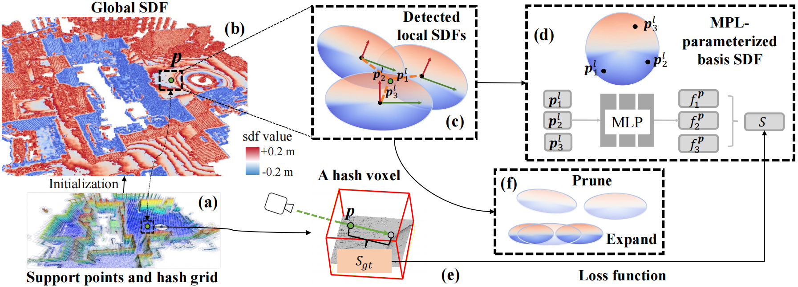

# SLNR
**A Super Lightweight Neural Representation for Large-scale 3D Mapping**
<br>Chenhui Shi, Fulin Tang, Hao Wei, Yihong Wu<br>

Abstract: *We propose a new and ultra-lightweight neural representation with outstanding performance for large-scale 3D mapping. The representation defines a global signed distance function (SDF) in near-surface space based on a set of band-limited local SDFs anchored at support points sampled from point clouds. These SDFs are parameterized only by a tiny multi-layer perceptron (MLP) with no latent features, and the state of each SDF is modulated by three learnable geometric properties: position, rotation, and scaling, which make the representation adapt to complex geometries. Then, we develop a novel parallel algorithm tailored for this unordered representation to efficiently detect local SDFs where each sampled point is located, allowing for real-time updates of local SDF states during training. Additionally, a prune-and-expand strategy is introduced to enhance adaptability further. The synergy of our low-parameter model and its adaptive capabilities results in an extremely compact representation with excellent expressiveness.*



## Introduce

This repository provides four core components: 
- A local SDF representation without relying on latent features;
- A parallel local SDF detection algorithm for real-time optimization;
- A prune-expand strategy to enhance the adaptability;
- Parallel point sampling along rays in a spatial hash grid.

## Install 

The code was tested on an RTX 4090 GPU with CUDA-11.8 equipped. First, install the Python environment:

```bash
conda create --name slnr python=3.8
pip install torch==2.0.0 torchvision==0.15.1 torchaudio==2.0.1 --index-url https://download.pytorch.org/whl/cu118
pip install open3d pypose opencv-python scikit-image
```

```bash
cd ./Thirdparty/sparse_hash && mkdir build && cd build
cmake -DCMAKE_PREFIX_PATH=your_envs/lib/python3.8/site-packages/torch  ..
make -j$(nproc)

cd ./Thirdparty/gaussian_search && mkdir build && cd build
cmake -DCMAKE_PREFIX_PATH=your_envs/lib/python3.8/site-packages/torch  ..
make -j$(nproc)
```

## Run
